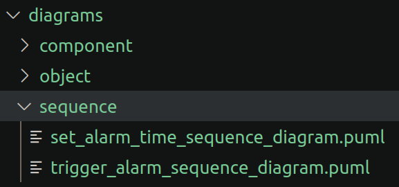

# Sequence Examples

## Basic Command Execution

```bash
$ aac puml-sequence ./tests/alarm_clock/usecase.yaml ./tests/alarm_clock/diagrams/sequence
All AaC constraint checks were successful.
Wrote PUML Sequence Diagram(s) to ./tests/alarm_clock/diagrams/sequence/.
```

## Basic Command File Content

```
@startuml Set Alarm Time Sequence Diagram
title Set Alarm Time Sequence Diagram

participant External as user
participant AlarmClock as alarm_clock
participant ClockTimer as timer

user -> alarm_clock : setAlarm
alarm -> timer : setTime

@enduml
```

## Command with Classification Execution

```bash
$ aac puml-sequence ./tests/alarm_clock/usecase.yaml ./tests/alarm_clock/diagrams/sequence --classification unclassified
All AaC constraint checks were successful.
Wrote PUML Sequence Diagram(s) to ./tests/alarm_clock/diagrams/sequence/.
```

## Command with Classification File Content

```
##### UNCLASSIFIED #####

@startuml Set Alarm Time Sequence Diagram
title Set Alarm Time Sequence Diagram

participant External as user
participant AlarmClock as alarm_clock
participant ClockTimer as timer

user -> alarm_clock : setAlarm
alarm -> timer : setTime

@enduml

##### UNCLASSIFIED #####
```

## Command Execution Failure

```bash
$ aac puml-sequence ./tests/alarm_clock/alarm_clock.yaml ./tests/alarm_clock/diagrams/sequence
No applicable use case definitions to generate a sequence diagram.
```

## Generated Files


