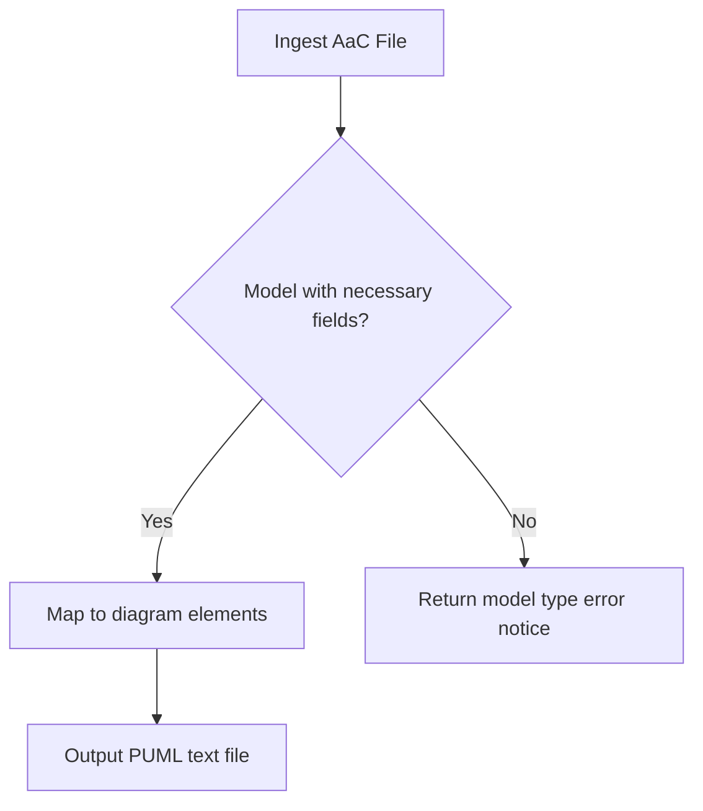

# Supported PUML diagrams

There are currently four diagram types the AaC PUML Plugin supports: component, object, requirements, and sequence.

For a basic overview of PUML diagraming, view their [documentation](https://plantuml.com).

AaC's PUML Plugin is built around the structures and design provided by PUML by relating the pertinent model fields to the diagram elements. AaC ingests and
parses a full model structure, then extracts the necessary fields, and finally maps them to the related diagram elements to output an acceptable formatted PUML
file that can be rendered as the PUML diagram.

## Component Diagrams

For direct information on PUML component diagrams, view the [component diagram documentation](https://plantuml.com/component-diagram).

A component diagram helps to represent the organization and relationship of system components so that complex systems are able to be better understood and evaluated for interdependencies and efficient design.

For viewing example usage and results of the component diagram generation, view [Component Examples](component_examples).

## Object Diagrams

For direct information on PUML object diagrams, view the [object diagram documentation](https://plantuml.com/object-diagram).

An object diagram shows objects and their relationships in a snapshot of the system's structure.

For viewing example usage and results of the object diagram generation, view [Object Examples](object_examples).

## Sequence Diagrams

For direct information on PUML sequence diagrams, view the [sequence diagram documentation](https://plantuml.com/sequence-diagram).

A sequence diagram helps to represent the organization and relationship of system components so that complex systems are able to be better understood and evaluated for interdependencies and efficient design.

For viewing example usage and results of the component diagram generation, view [Component Examples](component_examples).

## Component Diagrams

For direct information on PUML component diagrams, view the [component diagram documentation](https://plantuml.com/component-diagram).

A component diagram helps to represent the organization and relationship of system components so that complex systems are able to be better understood and evaluated for interdependencies and efficient design.

For viewing example usage and results of the component diagram generation, view [Component Examples](component_examples).